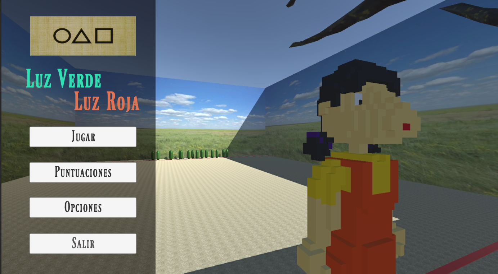
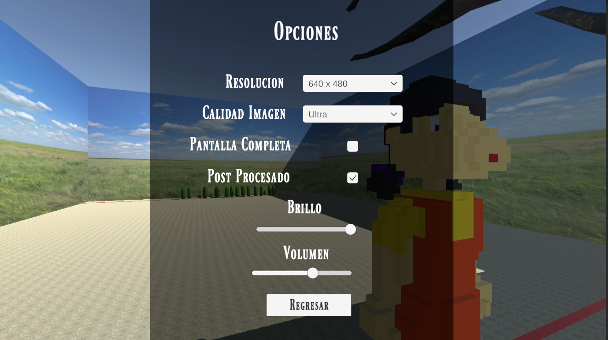
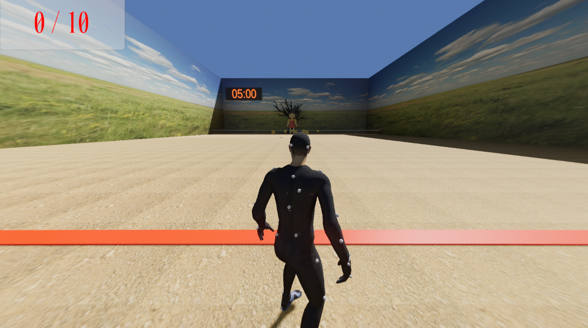
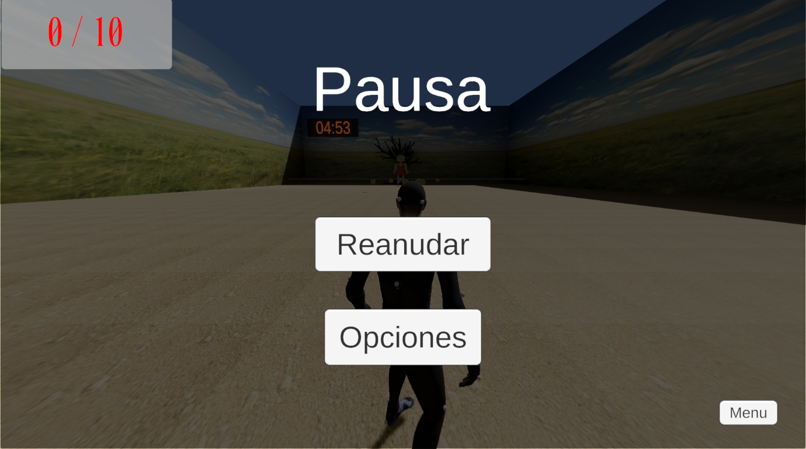
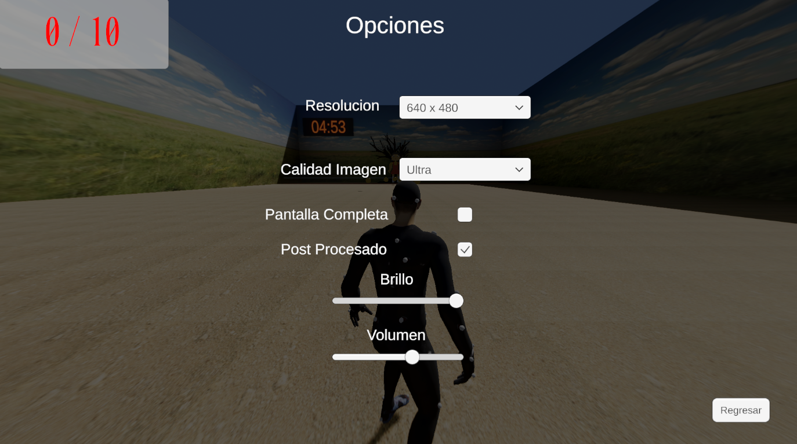
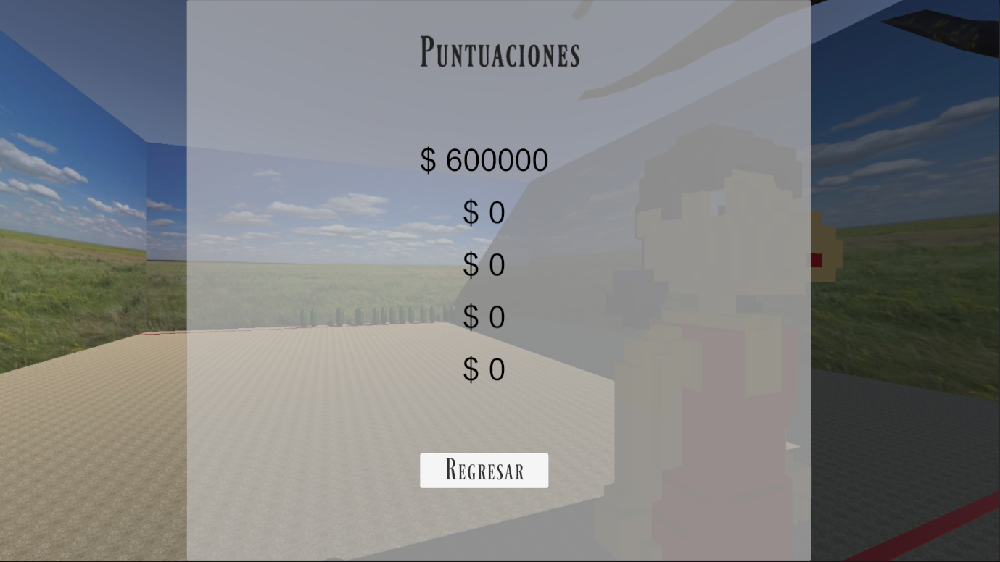

# Juego Luz Verde Luz Roja
Este es un proyecto de un videojuego desarrollado en [Unity](https://unity.com/es) para la clase de Administración de Proyectos de Software, de la carrera de Ingeniería en Computación, dentro de la Facultad de Ingeniería, Arquitectura y Diseño, de la Universidad Autónoma de Baja California.
El juego está basado en el juego de "luz verde luz roja" mostrado en la actualmente popoular serie de Netflix "El juego del calamar" - *Squid Game* .

## Instrucciones
Para poder instalar el juego es necesario descargar el archivo ejectutable que se encuentra en el repositorio y ejecutarlo.

El juego consiste en avanzar de una zona a otra mientras la muñeca está volteada y cantando, segundos antes que esta deje de cantar y gire a vernos a nosotros debemos dejar de avanzar, y podremos avanzar hasta que se vuelva a girar dándonos la espalda y comience a cantar nuevamente.

Dentro del juego se cuenta con un tiempo límite de 5 minutos para llegar al punto de meta, una vez que se cruza al punto de meta antes de que los 5 min terminen se gana el juego.

Este juego desarrollado tiene unas pequeñas variaciones en cuanto al juego original, la idea principal es la explicada anteriormente, sin embargo, se le agregó un sistema de puntuación el cual depende de qué tanto tiempo le tome al jugador el llegar a la meta, entre más rápido se llegue a la meta, mejor puntuación se obtiene.

Además de esto, en el escenario se encuentran 10 monedas las cuales proporcionarán puntos extra al puntaje final, estas se consiguen simplemente pasando por encima de ellas.

## Imágenes del juego

